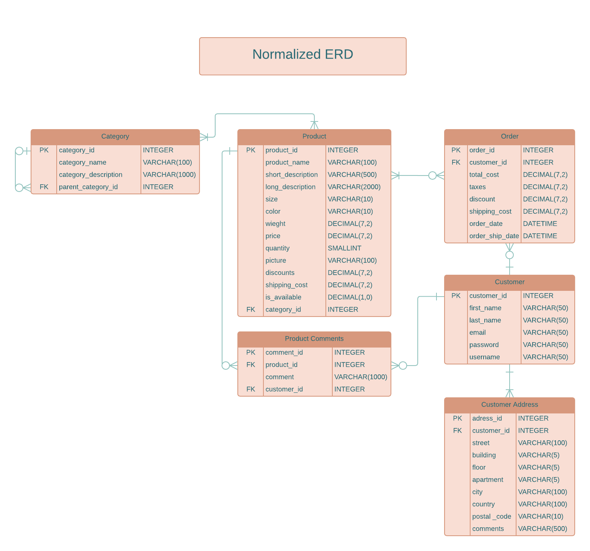

# [Practical Web DataBase Design](https://link.springer.com/book/10.1007/978-1-4302-5377-8)

This README file presents my hands-on project inspired by the database concepts covered in the book.
I've also developed example applications as described in the text.
This repository is the result of a collaborative effort during a 6-month mentorship program led by [Eng.Ahmed Emad](https://www.linkedin.com/in/ahmed-emad-abdelall/).

## Book E-commerce Example
- The Entity Relation Diagram Representing The System.

    

<h3 align="center">E-Commerce ERD Diagram</h3>

- Decomposing The Many To Many Relations Into Separate Table.

  

    

<h3 align="center">E-Commerce ERD Decomposed Diagram</h3>

- A Denormalized Version Of The Diagram 
> Here is Redundant info, but it offers a **Better Performance** by avoiding joining many tables.

  

    

<h3 align="center">E-Commerce ERD Denormalized Diagram</h3>

## Summary of Some Queries and their optimizations

| Sample Query | Execution Time Before Optimization | Optimization Technique | Rewritten Query | Execution Time After Optimization |
|--------------|------------------------------------|------------------------|-----------------|-----------------------------------|
| select CATEGORY_ID , count(PRODUCT_ID) as TOTAL_PRODUCTS_NUMBER from product_category pc group by CATEGORY_ID | 70.2 ms | Create a composite index on category id and product id for product_category table | - | 0.3 ms |
| select CUSTOMER_ID,CONCAT(c.FIRST_NAME,' ', c.LAST_NAME) as CUSTOMER_NAME, sum(TOTAL_COST) as TOTAL_SPENDING from orders o inner join customer c on c.ID = o.CUSTOMER_ID group by CUSTOMER_ID  order by TOTAL_SPENDING desc | 147499 ms | Query Rewriting and adding a composite index on cutomer id and total price for orders tables | select CUSTOMER_ID,CONCAT(c.FIRST_NAME,' ', c.LAST_NAME) as CUSTOMER_NAME, TOTAL_SPENDING from (select CUSTOMER_ID, sum(TOTAL_COST) as TOTAL_SPENDING from orders o group by CUSTOMER_ID order by TOTAL_SPENDING desc) o inner join customer c on c.ID = o.CUSTOMER_ID  | 2120 ms |
| SELECT o.ID , o.order_date, o.TOTAL_COST , c.id, c.first_name, c.last_name, c.email FROM customer c JOIN orders o ON o.customer_id = c.ID  ORDER BY o.order_date DESC LIMIT 1000; | 1705 ms | Create an index on order date | - | 0.378 ms |
| select p.NAME  from product p where p.QUANTITY < 60 | 0.0567 ms | Create a composite index on name and quantity | - | 0.0262 ms |
| select c.ID ,c.NAME , sum(p.PRICE) from order_detail od inner join product p on p.ID = od.PRODUCT_ID  inner join product_category pc  on pc.PRODUCT_ID = p.ID  inner join category c on c.ID = pc.CATEGORY_ID  group by c.id | 8357 ms | Using the denormalized table SALES_HISTORY with covering index | - | 5280 ms |

## Index:
- [Tables Creation Scripts](TablesDDLScripts.sql)
- [Random Data Generation Procedures up to 2 million record per table to test performance](dataGenerationProcedures)
- [Some Common Queries, e.g., top-selling products And Daily or Monthly Reports](sampleQueries)
- [More Details on Optimization Techniques](QueriesOptimizationTechniques)
